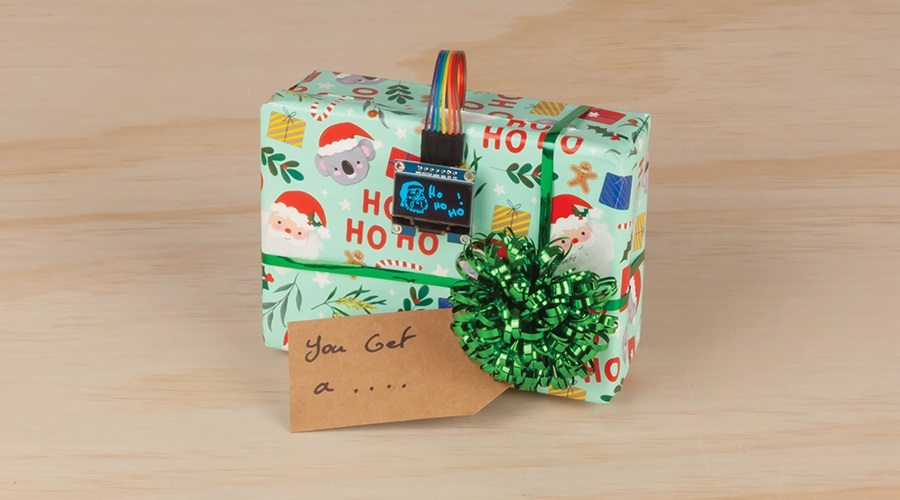

# Shake the present

Shake the box to find what you get in this magic 8-ball styled christmas gift game.

## Bill of Materials

| Qty | Code                                     | Description                  |
| --- | ---------------------------------------- | ---------------------------- |
| 1   | [XC4410](https://jaycar.com.au/p/XC4410) | Arduino Uno compatible board |
| 1   | [XC3728](https://jaycar.com.au/p/XC3728) | 1.3" Monochrome OLED         |
| 1   | [XC3732](https://jaycar.com.au/p/XC3732) | Tri Axis Digital Tilt Sensor |
| 1   | [WC6028](https://jaycar.com.au/p/WC6028) | Plug socket leads            |
| 1   | [PH9251](https://jaycar.com.au/p/PH9251) | Battery DC lead              |
| 1   | [SB2423](https://jaycar.com.au/p/SB2423) | Battery                      |

### You might also want

- Some sort of "project box" to mount it all in so you can dress it up like a present. We do have a [range of enclosures](https://www.jaycar.com.au/search?text=enclosures) available and for our purposes we used the box from the [Duinotech Starter Kit](XC3902) (- _only $40 so it's a good buy for christmas if you are stuck for ideas anyway_)

## How to build

For instructions on how to build, check out: https://jaycar.com.au/gift-guessing-game

## Working principle

The basis of this is using the [XC3732](https://jaycar.com.au/p/XC3732) Tri Axis tilt sensor to detect the magnitude of acceleration that the box is going under

We use [Pyagrath's Theorem](https://en.wikipedia.org/wiki/Pythagorean_theorem) to find the total magnitude, and use a [Rolling, or Simple Moving Average](https://www.investopedia.com/terms/s/sma.asp) to smooth out spikes in the data, so a sharp knock will not trip the shake counter (as the spike in data will be smoothed out). If you want to see this in action, uncomment the `RAW_LOG` define near the top of the code.

After about 5 shakes, we show another image on the OLED, and after 10 shakes, we generate a random number and "roll" to the gift that the person gets.

### Memory Limitations

There's very limited memory on the ATMEGA 328P chip, which isn't made any easier with the variety of feature-full libraries that are available through the library manager. For this project, the memory space very quickly ran out of room trying to manage both the accelometer and oled objects, causing a reboot once it reaches to a certain point in the program.

To overcome this we used some resource allocation in our core methods: `draw()` and `measureShake()`.

Here, each method _creates_ the object that it is managing. For instance, the `draw()` function  creates the `U8g2lib` object, draws things on the screen, and then deletes the object, thus freeing the memory. Similarly, the `measureShake()` will create the accelerometer management object, take readings, and store it in the buffer to be averaged later, before deleting the accelometer object again.

In many applications this is slow to do, but for our purposes, it actually functions fine and utilises more of the speed that is available for us via the ATMEGA328P.